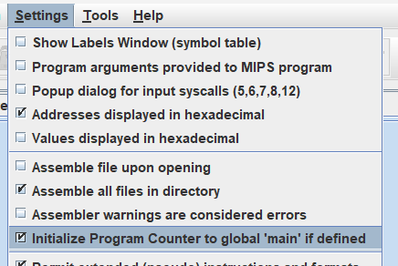

# 128A Barcode Generator in MIPS

This repository hosts an enhanced version of the "128A Barcode Generator in MIPS," originally created by [bkorkmaz29](https://github.com/bkorkmaz29). The modifications and improvements made to this project are intended to provide a more robust and customizable barcode generation experience. This barcode generator is a project that was created as a part of "Elements of Computing Systems 2" course for Semester 2.

## Original Creator
The initial version of this project was developed by [bkorkmaz29](https://github.com/bkorkmaz29). We express our gratitude to them for their original work in implementing the 128A barcode generation in the MIPS assembly language.

## Modifications Made
In this enhanced version, we have made several key modifications:

1. **Output BMP File Size Increased:** To enhance the clarity and readability of generated barcodes, we've increased the output BMP file size and modified where the barcode starts.

2. **Code Organization:** The code has undergone significant restructuring to make it more comprehensible and maintainable. Different functions are now organized in separate files, improving code organization. All the functions/files are properly interlinked as well.

3. **Color Selection:** Users now have the flexibility to choose different colors for the generated barcodes, allowing for more customization.

4. **Error Handling:** Error handling has been implemented to provide informative messages in case of any issues during barcode generation.

## Project Overview
The 128A Barcode Generator in MIPS is a software project developed as part of the "Elements of Computing Systems 2" course during Semester 2. This project enables the generation of Code 128A barcodes, a popular barcode standard widely used in various industries, including retail and logistics.

Key features of this project include:

- **Barcode Generation:** The program can generate 128A barcodes based on user-provided input data.

- **Customization:** Users can customize the appearance of the barcode, including its size, color, and data input.

- **Error Handling:** The software incorporates error-handling mechanisms to gracefully handle issues that may arise during barcode generation.
    - Invalid Width: 

    

    - Invalid Color:

    

    - Input file missing:

    

- **Ease of Use:** The program is designed to be user-friendly, with clear instructions and an intuitive interface.

    

This project serves as an educational tool for understanding barcode generation, MIPS assembly programming, and software development processes. It showcases how low-level programming languages like MIPS can be utilized for practical applications such as barcode generation.

## Prerequisites 
To run this barcode generator, you will need the following:

- **MIPS Simulator (e.g., MARS):** You can download MARS from [here](https://courses.missouristate.edu/kenvollmar/mars/download.htm) or use the one given in this repository.

- In the settings menu in MARS, enable "Assemble all files in directory" and "Initialize Program Counter to global "main" if defined" options.

    

- Do not delete the "source.bmp" file in "io files" directory. 

## How to Run the Code
- Clone this repository to your local machine:

    ```git clone https://github.com/amri-tah/MIPS-Barcode-Generator.git```

- Open MARS and load the MIPS assembly file (BarCodeGenerator.s).

- 'Assemble' and 'Run' the code.

- Follow the on-screen instructions to generate barcodes.

- The output file will be saved in as "output.bmp" in the "io files" directory.


## Screenshots
Sample screenshots of the generated barcodes with various styles and color choices are available in the "sample outputs" directory of this repository. These visuals provide an overview of the barcode customization options available in this enhanced version.
